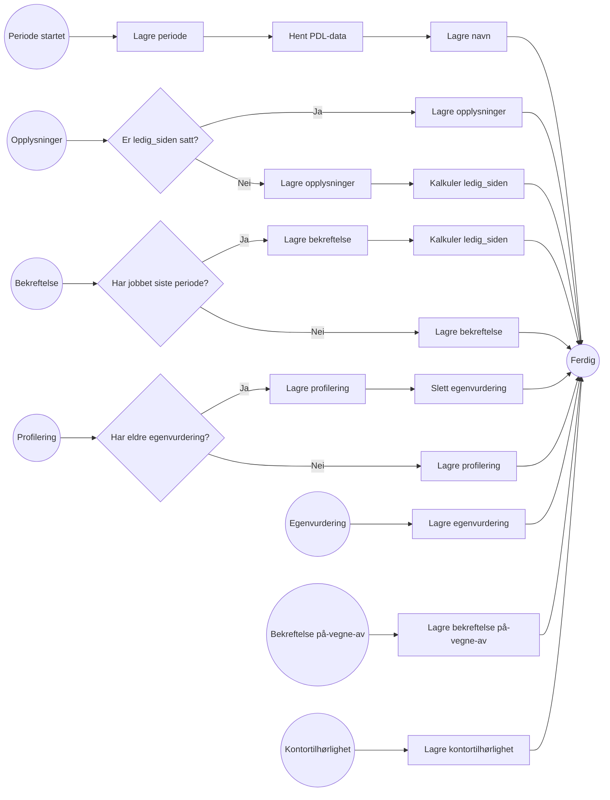

# Oversikt API

API som skal gi saksbehandlere oversikt over porteføljen for sitt kontor. Det er en aggregering av data på tvers av
Arbeidssøkerregisteret med fokus på arbeidssøkeres ledighet og andre viktige datapunkter. Skal kunne filtrere på
ledighet og egenvurdering nyere enn en gitt dato.

## Dataelementer

* Identitet - Vedlikehold ved hjelp av identitet-topic
* ~~ArbeidssøkerId?~~
* Navn
    * Hent fra PDL ved periode start
* Periode
* Kontortilhørlighet
    * Liste
    * [DAB datamodell](https://ao-oppfolgingskontor.intern.dev.nav.no/sdl)
* Ledighet
    * Ledig siden dato
        * nulles ved "har jobbet"
        * gjelder fra for første bekreftelser
        * om har svart "har ikke jobbet" med gap på mer enn 14 dager, sett med fra dato etter gap
    * Siste gjelder til
* Bekreftelse
    * Fra dato
    * Til dato
* Profilering -> Slette tidligere egenvurdering om egenvurdering.profilering_id != ny profilering_id?
    * Siste
* Egenvurdering
    * Siste
* På-vegne-av -> Ny på-vegne-av-start så legges kilde til i listen (om den ikke finnes fra før). Tom liste =
  Arbeidssøkerregisteret har ansvaret selv.
    * Liste

### Hendelser
Logikk for mottak av hendelser.

## Spørre

* Ledighet nyere/eldre enn
* Egenvurdert nyere enn

## Sikkerhet

* Azure saksbehandler token med ident
* Tilgangsstyring
* Auditlogging? nei, trenger ikke auditlogge for listevisninger

## Testdata

| identitetsnummer | navn                     | ledig_siden | tilknyttet_kontor                                   |
|------------------|--------------------------|-------------|-----------------------------------------------------|
| 24849098329      | SUNN VESTIBYLE           | 2026-04-30  | 4154:ARBEIDSOPPFOLGING, 0617:GEOGRAFISK_TILKNYTNING |
| 16488315440      | SLAKK KAKAOBØNNE         | 2026-06-03  | 0617:ARBEIDSOPPFOLGING, 0617:GEOGRAFISK_TILKNYTNING |
| 09448718961      | GJENNOMSIKTIG RØDFOTSULE | 2026-06-04  | 0617:GEOGRAFISK_TILKNYTNING                         |
| 24488623539      | EKSPLOSIV SKORPION       |             | 3030:GEOGRAFISK_TILKNYTNING                         |
| 02838698800      | TANKEFULL KLISJÉ         |             | 0118:GEOGRAFISK_TILKNYTNING                         |
| 28888896696      | SAKTE NORDAVIND          |             | 0604:GEOGRAFISK_TILKNYTNING                         |
