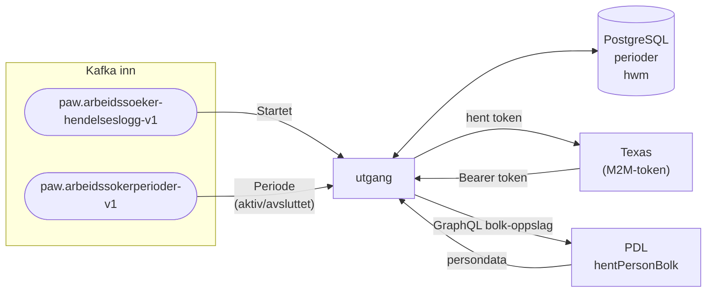

# utgang

Overvåker aktive arbeidsøkerperioder og sjekker løpende om registrerte arbeidssøkere fremdeles oppfyller inngangsvilkårene. Applikasjonen henter oppdaterte persondata fra PDL, utleder opplysninger og evaluerer disse mot regler — slik at perioder kan avsluttes automatisk («utgang») for de som ikke lenger kvalifiserer.

---

## Innhold

- [Arkitektur](#arkitektur)
- [Flyt](#flyt)
- [Databasemodell](#databasemodell)
- [Kjøre lokalt](#kjøre-lokalt)

---

## Arkitektur



---

## Flyt

### 1. Mottak fra hendelseslogg (`paw.arbeidssoeker-hendelseslogg-v1`)

Når en `Startet`-hendelse mottas lagres perioden med initiell tilstand:

- `arbeidssoeker_id` og `identitetsnummer` settes fra hendelsen
- `tilstand.initielle` settes til opplysningene som fulgte med hendelsen
- `bekreftet = false` — perioden er ikke bekreftet via periode-topicen ennå
- `trenger_kontroll = false` — ny periode, PDL-data er ikke hentet ennå

### 2. Mottak fra periode-topic (`paw.arbeidssokerperioder-v1`)

Kafka-meldingene fra periode-topicen er den autoritative kilden for periodedata:

- **Aktiv periode** (`avsluttet = null`): upsert som bekrefter perioden (`bekreftet = true`). Eksisterende `tilstand` fra hendelsesloggen bevares (COALESCE).
- **Avsluttet periode** (`avsluttet` er satt): `stoppet`-feltet populeres med tidspunkt og hvem som stoppet perioden.

### 3. PDL-oppdatering (bakgrunnsjobb)

En bakgrunnsjobb kjører kontinuerlig og oppdaterer persondata for perioder der dataene har blitt eldre enn 24 timer (`sist_oppdatert < nå - 24t`):

1. Henter en batch utdaterte perioder (maks 1 000 om gangen)
2. Gjør et bolk-oppslag mot PDL (`hentPersonBolk`) med tilhørende identitetsnumre — autentisert med M2M-token fra Texas
3. Utleder nye opplysninger fra PDL-data ved hjelp av `regler_arbeidssoeker::fakta`
4. Oppdaterer `tilstand.gjeldende` med de nye opplysningene og setter `trenger_kontroll = true`

Perioder der PDL ikke returnerer persondata hoppes over uten oppdatering.

### 4. Kontrolloppgave (bakgrunnsjobb — under utvikling)

En separat bakgrunnsjobb er tiltenkt å evaluere perioder med `trenger_kontroll = true` mot `Regelsett` fra `regler_arbeidssoeker`. Logikken er foreløpig ikke implementert.

---

## Databasemodell

### `perioder`

| Kolonne                    | Type        | Beskrivelse                                              |
|---------------------------|-------------|----------------------------------------------------------|
| `id`                      | UUID PK     | Periode-ID — samme UUID som i `Startet`-hendelsen       |
| `arbeidssoeker_id`        | BIGINT      | Intern ID for arbeidssøkeren                             |
| `identitetsnummer`        | VARCHAR     | Fødselsnummer / D-nummer                                 |
| `stoppet`                 | JSONB       | Satt når perioden er avsluttet (`tidspunkt`, `utfoert_av`) |
| `sist_oppdatert`          | TIMESTAMP   | Tidspunkt for siste PDL-oppdatering — brukes som vannmerke |
| `trenger_kontroll`        | BOOLEAN     | `true` når ny PDL-data er klart for evaluering           |
| `siste_kontroll_tidspunkt`| TIMESTAMP   | Tidspunkt for siste regelkjøring                         |
| `tilstand`                | JSONB       | `initielle`, `gjeldende` og `forrige` opplysninger med evaluering |
| `bekreftet`               | BOOLEAN     | `true` når perioden er bekreftet via periode-topicen     |

### `hwm`

Kafka high-watermark for offset-tracking per topic og partisjon.

---

## Kjøre lokalt

Appen krever Kafka og PostgreSQL:

```sh
just infra-up
cargo run -p utgang
```

### Kjøre tester

```sh
just test utgang
```

Integrasjonstestene starter en Postgres-container automatisk via testcontainers.
