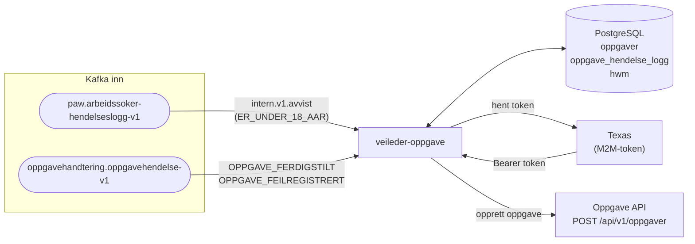

# Veileder-oppgave

Arbeidssøkere under 18 år avvises automatisk ved registrering. Appen lytter på slike avvisninger og oppretter oppgaver i [Oppgave API](https://github.com/navikt/oppgave) ([Swagger](https://oppgave.intern.dev.nav.no/)) så en NAV-veileder kan følge opp.

---

## Innhold

- [Arkitektur](#arkitektur)
- [Flyt](#flyt)
- [Oppgavestatuser](#oppgavestatuser)
- [Kjøre lokalt](#kjøre-lokalt)

---

## TODO:
- Startet hendelse
  - Skal være innsendt av sluttbruker 
  - Relevante opplysninger:
    - utflyttet eller ikke bosatt, sjekk dette.
    - EU/EØS borger
    - Ikke norsk statsborger
  - Lag oppgave i Oppgave API
  - Ny oppgavetype

## Arkitektur



---

## Flyt

### 1. Mottak av avviste hendelser (`paw.arbeidssoker-hendelseslogg-v1`)

Appen filtrerer hendelser av typen `intern.v1.avvist` med opplysningen `ER_UNDER_18_AAR`. Følgende regler gjelder:

- **Veileder ignoreres** — hendelser der `utfoertAv.type == VEILEDER` ignoreres. Kun bruker-initierte registreringer fører til oppgave.
- **Vannskille** — hendelser eldre enn `opprett_oppgaver_fra_tidspunkt` lagres med status `IGNORERT` og behandles ikke videre.
- **Duplikathåndtering** — dersom det finnes en aktiv oppgave (status ∉ `FERDIGBEHANDLET`, `IGNORERT`) for arbeidssøkeren, opprettes ikke en ny oppgave. Hendelsen logges som `OPPGAVE_FINNES_ALLEREDE`.
- **Ny oppgave etter ferdigbehandlet** — dersom forrige oppgave er ferdigbehandlet, opprettes en ny.

### 2. Opprettelse av oppgaver i Oppgave API

En bakgrunnsjobb kjører hvert minutt og behandler oppgaver med status `UBEHANDLET`:

1. Henter de eldste oppgavene (batch på inntil 50 i prod)
2. Shuffler listen tilfeldig for å unngå at alle pods tar samme oppgave
3. **CAS-lock** (`UPDATE ... WHERE status = 'UBEHANDLET'`) sikrer at kun én pod behandler hver oppgave
4. Kaller Oppgave API med oppgavetype `KONT_BRUK`, tema `GEN` og en fast beskrivelse om samtykke fra foresatte
5. Ved suksess: oppdaterer `ekstern_oppgave_id` og logger `EKSTERN_OPPGAVE_OPPRETTET`
6. Ved feil: setter status tilbake til `UBEHANDLET` og logger `EKSTERN_OPPGAVE_OPPRETTELSE_FEILET`

Oppgaver som feiler ≥ 5 ganger logger en advarsel om mulig kork.

### 3. Ferdigstilling av oppgaver (`oppgavehandtering.oppgavehendelse-v1`)

Når en oppgave ferdigstilles eller feilregistreres i Oppgave API mottar vi en hendelse. Appen matcher mot intern oppgave via `ekstern_oppgave_id` og oppdaterer status til `FERDIGBEHANDLET`.

> Tidspunkter fra Oppgave API er i Oslo-tid og konverteres til UTC ved mottak.

---

## Oppgavestatuser

```
UBEHANDLET ──(CAS)──► OPPRETTET ──────────────► FERDIGBEHANDLET
    ▲                     │
    └──── (API-feil) ─────┘

Hendelse eldre enn vannskillet ──► IGNORERT
```

| Status | Beskrivelse |
|---|---|
| `UBEHANDLET` | Avvist hendelse mottatt, venter på behandling |
| `OPPRETTET` | Oppgave sendt til Oppgave API (CAS-lås holder mens kallet pågår) |
| `FERDIGBEHANDLET` | Oppgave ferdigstilt eller feilregistrert eksternt |
| `IGNORERT` | Hendelse eldre enn vannskillet |

## Kjøre lokalt

Appen krever Kafka og PostgreSQL. Start avhengigheter med docker-compose:

```sh
docker compose -f docker/postgres/docker-compose.yaml up -d
docker compose -f docker/kafka/docker-compose.yaml up -d
cargo run -p veileder-oppgave
```

